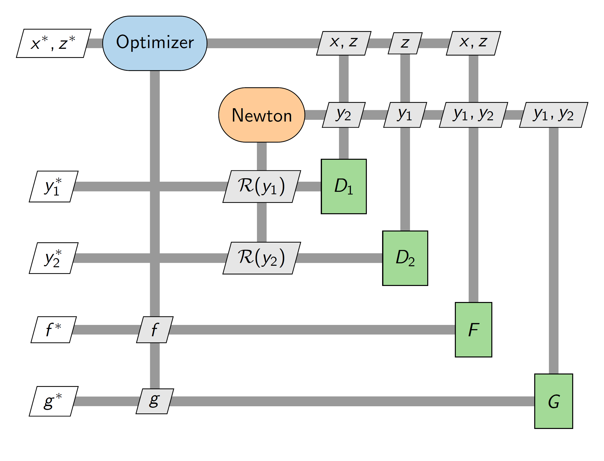

# pyXDSM

A python library for generating publication quality PDF XDSM diagrams.
This library is a thin wrapper that uses the TikZ library and LaTeX to build the PDFs.

# Documentation

Please see the [documentation](https://mdolab-pyxdsm.readthedocs-hosted.com) for installation details and API documentation.

To locally build the documentation, enter the `doc` folder and enter `make html` in the terminal. 
You can then view the built documentation in the `_build` folder.

## Citation
Please cite the [paper by Lambe and Martins](http://mdolab.engin.umich.edu/bibliography/Lambe2012a.html) when using XDSM.
Here is the bibtex entry for that paper:

    @article {Lambe2012,
    title = {Extensions to the Design Structure Matrix for the Description of Multidisciplinary Design, Analysis, and Optimization Processes},
    journal = {Structural and Multidisciplinary Optimization},
    volume = {46},
    year = {2012},
    pages = {273-284},
    doi = {10.1007/s00158-012-0763-y},
    author = {Andrew B. Lambe and Joaquim R. R. A. Martins}
    }

