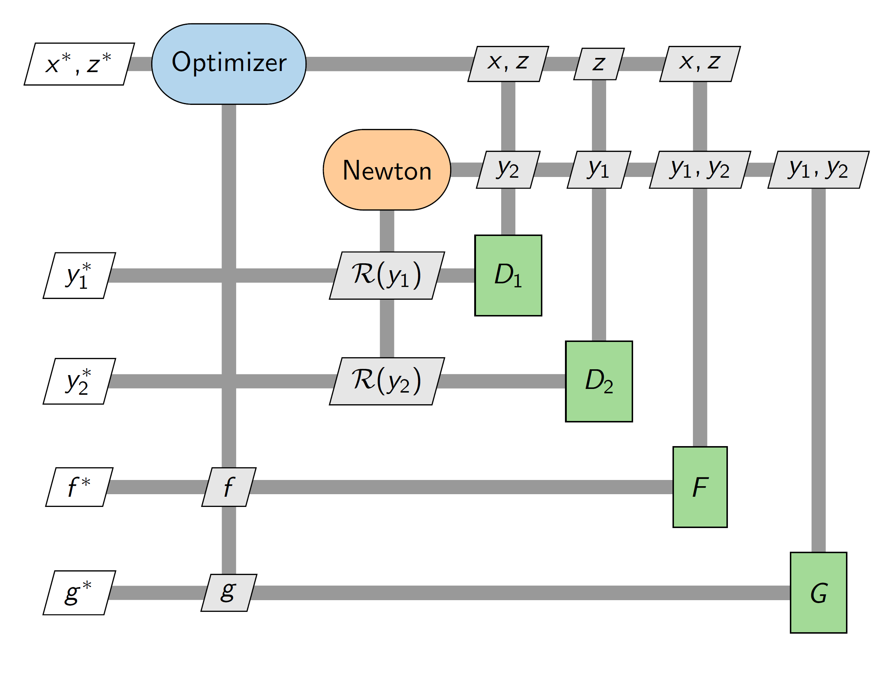
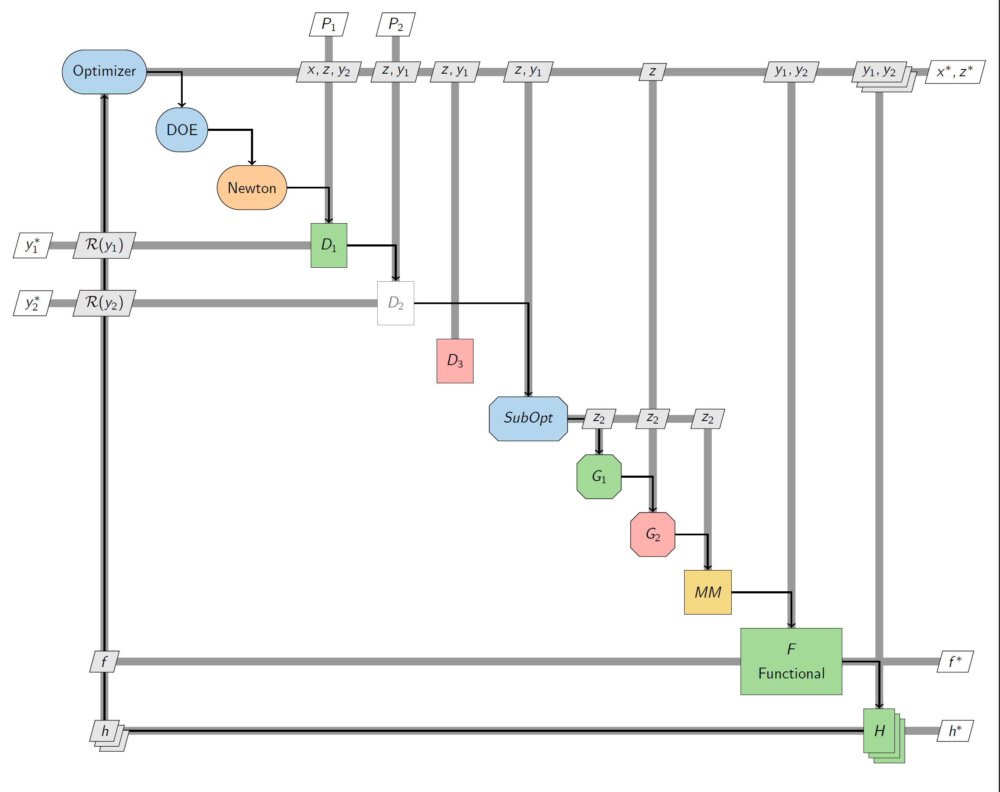
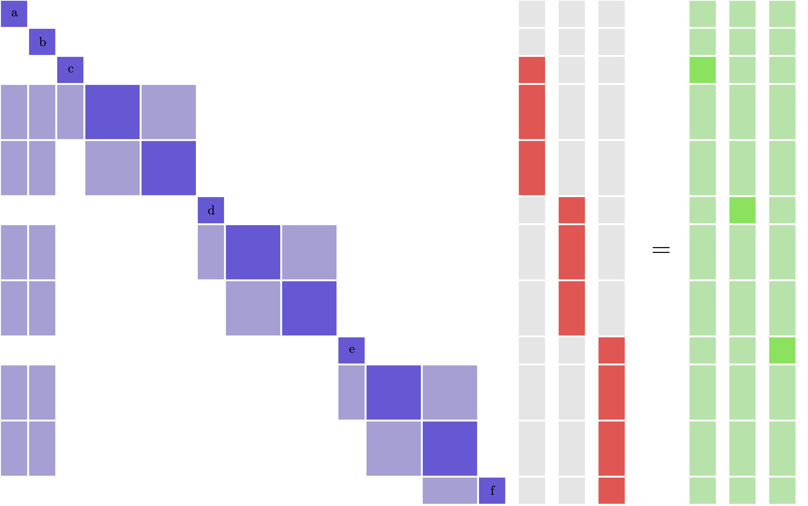

.. _pyXDSM_examples:

Examples
========
Here is a simple example.
There are some other more advanced things you can do as well.
Check out the `examples folder <https://github.com/mdolab/pyXDSM/blob/master/examples>`_ for more complex scripts.

.. literalinclude:: ../examples/mdf.py

This will output ``mdf.tex``, a standalone tex document that (by default) is also compiled to ``mdf.pdf``, shown below:

This example uses the `.to_json` method to serialize the XDSM to a JSON file:

.. literalinclude:: ../examples/mdf.json

This can be loaded programmatically using the static :meth:`~pyxdsm.XDSM.XDSM.from_json` method.
Alternatively a command-line tool can be used to write the JSON to a PDF, a tikz file, or another JSON file.

Command-line Usage
------------------

The JSON file can be used directly from the command line:

.. code-block:: bash

   python -m pyxdsm mdf.json -o mdf.pdf

This generates a PDF from the JSON specification. Other output formats are also supported:

.. code-block:: bash

   # Generate only TikZ (no PDF compilation)
   python -m pyxdsm mdf.json -o mdf.tikz

   # Export to a different JSON file
   python -m pyxdsm mdf.json -o output.json

   # Generate PDF with default name (mdf.pdf)
   python -m pyxdsm mdf.json

For more options, use the ``--help`` flag:

.. code-block:: bash

   python -m pyxdsm --help

More complicated example
------------------------

Here is an example that uses a whole bunch of the more advanced features in ``pyXDSM``.

It is mostly just a reference for all the customizations you can do.
The code for this diagram is `provided here <https://github.com/mdolab/pyXDSM/blob/master/examples/kitchen_sink.py>`_

Block matrix equation
---------------------

``pyXDSM`` can also generate a figure of a block matrix equation.
An example script is available `here <https://github.com/mdolab/pyXDSM/blob/master/examples/mat_eqn.py>`_.

