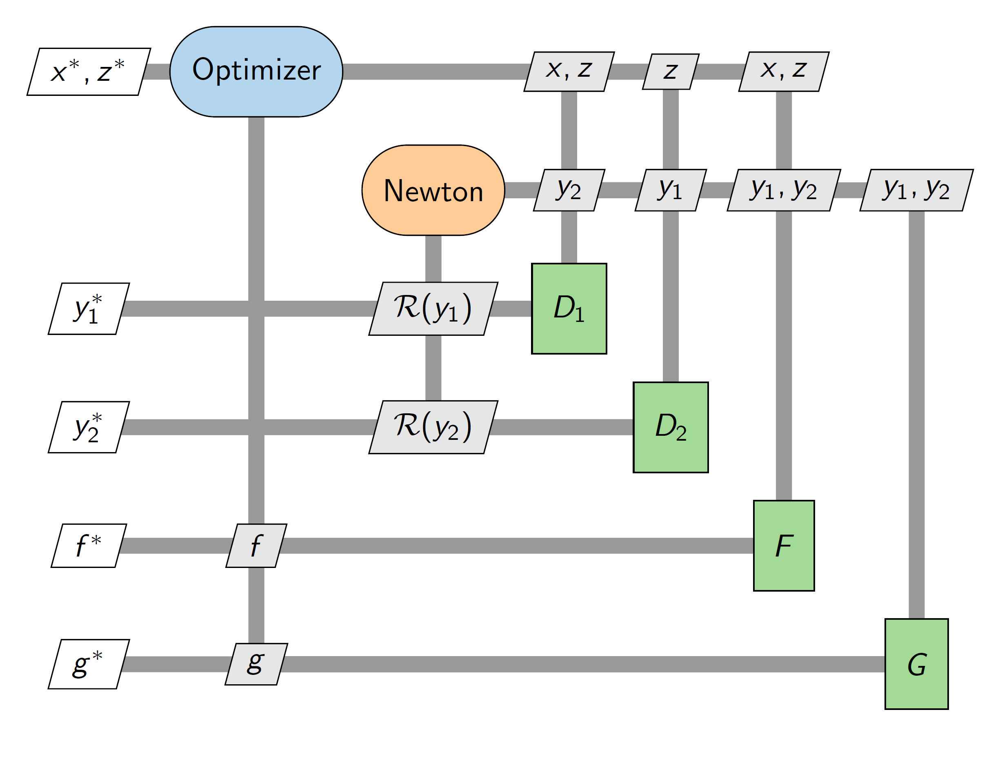

.. _pyXDSM_examples:

Examples
========
Here is a simple example. 
There are some other more advanced things you can do as well. 
Check out the `examples folder <https://github.com/mdolab/pyXDSM/blob/master/examples>`_ for more complex scripts.

.. literalinclude:: ../examples/mdf.py

This will output ``mdf.tex``, a standalone tex document that (by default) is also compiled to ``mdf.pdf``, shown below:

More complicated example
------------------------

Here is an example that uses a whole bunch of the more advanced features in ``pyXDSM``. 

.. image:: images/kitchen_sink.png
   :scale: 30

It is mostly just a reference for all the customizations you can do.
The code for this diagram is `provided here <https://github.com/mdolab/pyXDSM/blob/master/examples/kitchen_sink.py>`_